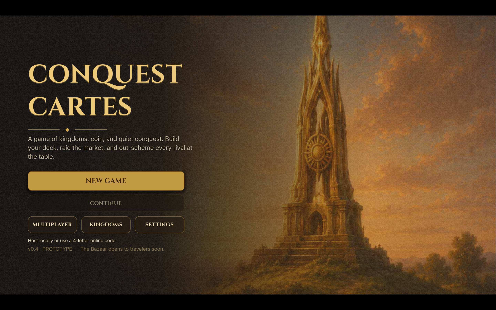
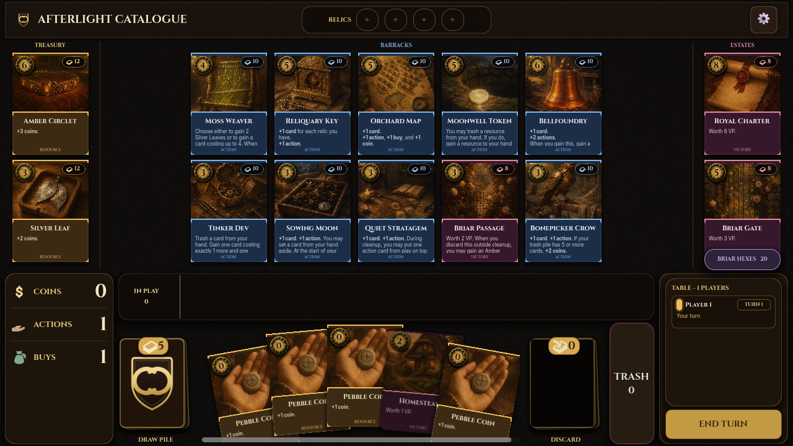

# Conquest Cartes

An original fantasy deck-builder, built in Godot 4.7. You start with a thin deck of coins and homesteads, buy better cards from a rotating market, and race to turn the final contents of your deck into victory points. It sits in the classic deck-building tradition while adding its own cards, painted art, relics, and time-based combat.

🌐 **Play it online:** [conquest-cartes.vercel.app](https://conquest-cartes.vercel.app/)





## What's in the game

It's a compact but complete deck-builder. The highlights:

- **63 data-driven cards** with original names and painted artwork, plus a named 26-card *Hinterlands* group inside the catalog.
- A **14-card kingdom market** each game: 2 resources, 10 actions, and 2 victory cards, laid out art-first (resources left, actions center, victory right).
- The full deck-builder verb set: draw, **trash, gain, upgrade, replay**, and variable scoring, with interactive prompts whenever a card asks you to choose (discard this, trash that, gain a card up to a cost, reorder your draw).
- **Reactive triggers** on gain, buy, discard, trash, and cleanup, so cards can respond to what's happening around them.
- The fiddly stuff, done right: temporary cost reductions, progressive resources, finite supply piles with visible counts and sold-out handling, and 0-cost **Briar Hex** curses worth -1 VP.
- **Multiplayer**, both direct-IP LAN tables and 4-letter online-code lobbies, with shared supplies and attacks that hit your rivals.
- A handmade medieval UI: dark jewel-toned cards, brass and slate, a little crest-style decoration, quiet UI sounds, layered background music, and an end-game score plaque. Card color tells you the type at a glance (golden-brown resources, midnight-blue actions, deep plum victory, violet-black curses).
- A tabbed **Kingdoms browser** with full card faces and toggles that filter the random market pool, plus home settings for visual noise and animation speed.

## How to play

1. Play resource cards to gain coins.
2. Spend actions to play action cards for more cards, actions, coins, or buys.
3. Spend one buy and enough coins to purchase a card from the shared market.
4. Purchased cards go to your discard pile and shrink that supply pile.
5. End the turn to discard your hand and played cards, reset your turn resources, and draw a fresh five.
6. The game ends when three supply piles empty, or the 6 VP pile empties.
7. Every victory point in your deck, hand, discard, and play area counts toward the final score.

Card trim tells you what's actionable: slate-trimmed hand cards are playable, forest-trimmed market cards are affordable, and muted trim marks what's currently out of reach. In singleplayer, End Turn is instant. In online lobbies it starts a 5-second cooldown, but (and this is the point) you can still play cards and buy from the market while it counts down, so nobody's just waiting.

## Multiplayer

`CREATE LOCAL` hosts a direct-IP desktop lobby on port `27041`. The host is Player 1; up to three others type the host's IP into the home-screen address field and press `JOIN LOCAL`.

`CREATE ONLINE` opens the online lobby setup. Press `CREATE LOBBY` to connect to the HTTP polling relay and get a 4-letter code; other players press `JOIN ONLINE` and enter it. The relay is a standalone Node service (`api/relay.js`) running as a single always-on instance on its own host, separate from the static web build, and every build targets its URL directly (currently `https://conquest-cartes-relay.onrender.com/api/relay`). The host owns the authoritative game state and relays every play, buy, choice, cooldown, attack, and score update to clients. Players act in parallel.

Fair warning: the relay keeps rooms in memory in one process, so it's still a prototype path. For fast public multiplayer at scale you'd want a proper realtime service that keeps each room on a single server (Durable Objects/PartyKit, Ably, Pusher). See `docs/online_multiplayer_plan.md`.

## Run locally

1. Install Godot 4.7 and its matching export templates.
2. Open Godot's Project Manager.
3. Import this directory's `project.godot`.
4. Press **F6** or the Play button.

The project targets a 1280x720 desktop viewport and uses the `gl_compatibility` renderer, which is what lets the same project run on the web.

## Tests

From the repo root:

```powershell
godot --headless --path . --script res://tests/smoke_test.gd
godot --headless --path . --script res://tests/ui_smoke_test.gd
```

The rules smoke test covers the main game loop, every playable card definition, focused multi-step effects, finite supplies, and market composition. The UI smoke test checks rendering, artwork, medieval assets, interactions, animations, audio, preview placement, and the final-score overlay.

There's also an end-to-end online multiplayer test that runs a host and a guest against the real relay over local HTTP:

```powershell
$env:PORT = '3123'; node api/relay.js   # keep running in another terminal
godot --headless --path . --script res://tests/relay_e2e_test.gd
```

## Web export and deployment

The committed `export_presets.cfg` has a threaded Web preset with cross-origin isolation enabled (the same settings used by the deployment workflow). Export locally with:

```powershell
New-Item -ItemType Directory -Path web -Force
godot --headless --path . --export-release "Web" web/index.html
```

The generated `web/` directory is intentionally gitignored.

Deployment is automatic: every push to `main` runs `.github/workflows/deploy.yml`, which downloads and caches Godot 4.7 and its export templates, imports the project, runs both smoke tests, exports the web build, and deploys to Vercel as a pure static site (with the COOP/COEP headers needed for cross-origin isolation, no serverless function). The result is live at [conquest-cartes.vercel.app](https://conquest-cartes.vercel.app/). The online relay is deployed separately on its own always-on host and isn't part of this workflow.

### Vercel preview deployment

The `deploy/afterlight-vercel` branch is for manual Vercel previews; it does not replace the `main` production workflow above. Before exporting, install Godot 4.7 with its matching export templates, Node.js 20 or newer, and authenticate the Vercel CLI (`vercel login`) or provide a `VERCEL_TOKEN`.

Current branch preview: [conquest-cartes-1eh3ak20e-william-chenyins-projects.vercel.app](https://conquest-cartes-1eh3ak20e-william-chenyins-projects.vercel.app). The Vercel team currently protects preview deployments, so visitors may be asked to sign in; production remains public at the URL above.

Run the local checks and export from the repository root:

```powershell
godot --headless --path . --script res://tests/smoke_test.gd
godot --headless --path . --script res://tests/ui_smoke_test.gd
New-Item -ItemType Directory -Path web -Force
godot --headless --path . --export-release "Web" web/index.html
```

Because `web/` is generated and gitignored, write the same static-host headers used in CI before deploying:

```powershell
@'
{
  "framework": null,
  "buildCommand": null,
  "outputDirectory": ".",
  "headers": [
    {
      "source": "/(.*)",
      "headers": [
        { "key": "Cross-Origin-Opener-Policy", "value": "same-origin" },
        { "key": "Cross-Origin-Embedder-Policy", "value": "require-corp" }
      ]
    }
  ]
}
'@ | Set-Content -Path web/vercel.json -Encoding utf8
Push-Location web
vercel link
vercel deploy --yes
Pop-Location
```

`vercel deploy` creates a preview for the linked project; leave off `--prod` so this branch cannot publish production. Only pushes to `main` run the GitHub Actions job that performs the authenticated `vercel ... --prod` deployment to the production site.

If you use token authentication instead of `vercel login`, append `--token $env:VERCEL_TOKEN` to both Vercel commands.

## Assets

- `assets/cards/` finished card illustrations
- `assets/ui/` original project-owned medieval interface assets
- `assets/imported/` third-party source packs kept for the record (the Kenney fantasy-border pack is no longer used by the active UI)
- `assets/audio/`, `assets/fonts/` (Cinzel and Inter), `assets/licenses/`

See `assets/licenses/ASSET_SOURCES.md` for sources and attribution details.

## Honest limitations

This is a compact prototype, balanced as one, not a finished commercial release. A few specifics:

- Local direct-IP multiplayer needs LAN reachability, port forwarding, or a VPN.
- The online relay keeps rooms in memory in a single process, so it must run as exactly one always-on instance, and open rooms are lost on restart or redeploy.
- No save system or full accessibility menu yet, and rival-only reaction clauses are omitted in the solo ruleset.
- The art library has 29 finished illustrations; the 63-card catalog references them, so related cards share paintings via the data-driven `art_id` field.

Writing new cards? Follow `docs/card_design_rules.md` and `docs/card_wording_conventions.md`.
